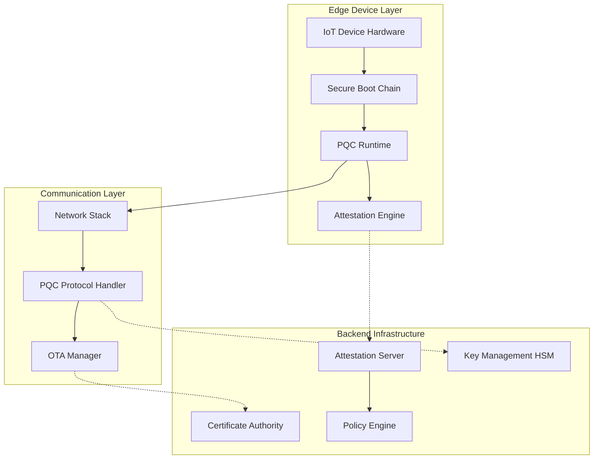
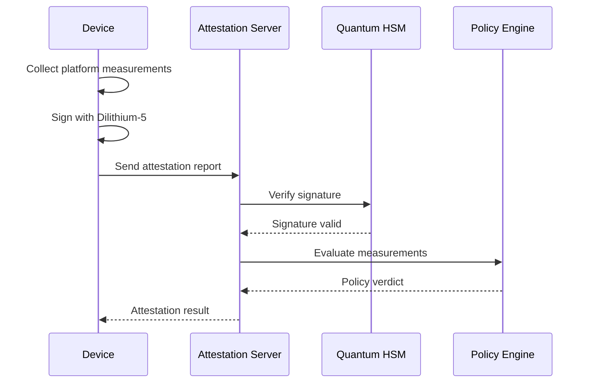
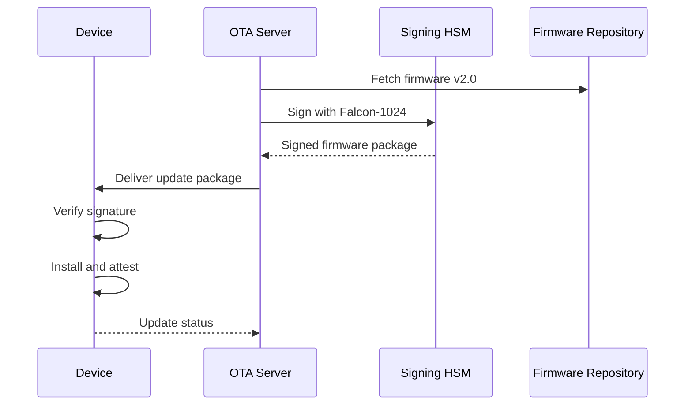

# PQC-Edge-Attestor Architecture

## System Overview

The PQC-Edge-Attestor framework provides a comprehensive quantum-resistant security solution for IoT edge devices, specifically targeting critical infrastructure like smart meters and EV chargers. The architecture follows a layered approach with clear separation of concerns.

## High-Level Architecture



## Component Architecture

### 1. Edge Device Components

#### Secure Boot Chain
- **ROM Bootloader**: Hardware-enforced root of trust
- **Primary Bootloader**: Falcon-1024 signature verification
- **Secondary Bootloader**: TPM PCR measurement extension
- **Application Firmware**: Main PQC runtime with attestation

#### PQC Cryptographic Engine
```c
typedef struct {
    kyber_keypair_t kem_keys;          // Key encapsulation
    dilithium_keypair_t sign_keys;     // Digital signatures
    falcon_keypair_t alt_sign_keys;    // Alternative signatures
    uint8_t device_id[32];             // Unique device identifier
    attestation_policy_t policy;       // Local attestation policy
} pqc_device_context_t;
```

#### Attestation Engine
- **Measurement Collection**: Platform state monitoring
- **Report Generation**: Cryptographically signed attestation reports
- **Policy Enforcement**: Local attestation policy validation
- **Secure Storage**: Key material and measurement logs

### 2. Communication Protocol Stack

#### Network Layer
- **Transport**: TLS 1.3 with PQC cipher suites
- **Application**: CoAP/MQTT with PQC extensions
- **OTA Protocol**: Secure firmware update channel

#### PQC Protocol Extensions
```protobuf
message AttestationReport {
  bytes device_id = 1;
  uint64 timestamp = 2;
  repeated PlatformMeasurement measurements = 3;
  bytes signature = 4;  // Dilithium-5 signature
  bytes nonce = 5;
}

message PlatformMeasurement {
  uint32 pcr_index = 1;
  bytes measurement_value = 2;
  string measurement_type = 3;
}
```

### 3. Backend Infrastructure

#### Attestation Verification Service
```python
class AttestationVerifier:
    def __init__(self, ca_certs, policies):
        self.ca_store = CertificateStore(ca_certs)
        self.policy_engine = PolicyEngine(policies)
        
    def verify_report(self, report: AttestationReport) -> VerificationResult:
        # 1. Verify cryptographic signature
        # 2. Check certificate chain
        # 3. Validate measurements against policy
        # 4. Check replay protection
        pass
```

#### Key Management Architecture
- **Root CA**: Offline quantum-safe certificate authority
- **Intermediate CAs**: Online signing authorities per deployment zone
- **Device Certificates**: Per-device identity and attestation keys
- **HSM Integration**: Hardware security modules for key protection

## Data Flow Diagrams

### Device Attestation Flow



### OTA Update Flow



## Security Architecture

### Cryptographic Algorithms

| Use Case | Classical (Hybrid) | Post-Quantum | Security Level |
|----------|-------------------|--------------|----------------|
| Device Identity | ECDSA P-384 | Dilithium-5 | NIST Level 5 |
| Key Exchange | ECDH P-384 | Kyber-1024 | NIST Level 5 |
| Firmware Signing | RSA-3072 | Falcon-1024 | NIST Level 5 |
| Random Generation | CTR-DRBG | SHAKE-256 | 256-bit |

### Security Boundaries

```
┌─────────────────────────────────────────────────────────────┐
│                    Trusted Computing Base                    │
├─────────────────────────────────────────────────────────────┤
│  Hardware Root of Trust (TPM 2.0 / ARM TrustZone)          │
│  ├─ Secure Boot Chain                                       │
│  ├─ Key Storage (Secure Element)                           │
│  └─ Measurement Engine                                      │
├─────────────────────────────────────────────────────────────┤
│  PQC Cryptographic Runtime                                  │
│  ├─ Algorithm Implementations                               │
│  ├─ Key Management                                          │
│  └─ Protocol Handlers                                       │
├─────────────────────────────────────────────────────────────┤
│  Application Layer (Untrusted)                              │
│  ├─ Business Logic                                          │
│  ├─ Network Interfaces                                      │
│  └─ User Interfaces                                         │
└─────────────────────────────────────────────────────────────┘
```

### Threat Model

#### In-Scope Threats
- **Quantum Computer Attacks**: Shor's and Grover's algorithms
- **Classical Cryptanalysis**: Side-channel, timing attacks
- **Firmware Tampering**: Malicious firmware installation
- **Supply Chain Attacks**: Compromised components
- **Network Attacks**: Man-in-the-middle, replay attacks

#### Out-of-Scope Threats
- **Physical Extraction**: Invasive hardware attacks
- **Social Engineering**: Human factor attacks
- **DDoS**: Availability attacks on infrastructure
- **Regulatory Compliance**: Legal and compliance issues

## Deployment Architecture

### Smart Grid Deployment

```
┌─────────────────┐    ┌──────────────────┐    ┌─────────────────┐
│   Smart Meters  │    │ Utility Network  │    │  Grid Control   │
│                 │    │                  │    │     Center      │
├─────────────────┤    ├──────────────────┤    ├─────────────────┤
│ • PQC Runtime   │◄──►│ • AMI Headend    │◄──►│ • SCADA/EMS     │
│ • TPM 2.0       │    │ • Attestation    │    │ • Policy Mgt    │
│ • OTA Client    │    │   Gateway        │    │ • CA Services   │
│ • Measurement   │    │ • FW Repository  │    │ • HSM Cluster   │
└─────────────────┘    └──────────────────┘    └─────────────────┘
        │                        │                        │
        └────────────────────────┼────────────────────────┘
                                 │
                    ┌─────────────▼─────────────┐
                    │    Quantum-Safe PKI      │
                    │  • Root CA (Offline)     │
                    │  • Intermediate CAs      │
                    │  • Certificate Policies  │
                    └───────────────────────────┘
```

### EV Charging Network

```
┌─────────────────┐    ┌──────────────────┐    ┌─────────────────┐
│  EV Chargers    │    │  Charging Mgmt   │    │   Grid Operator │
│                 │    │    Platform      │    │                 │
├─────────────────┤    ├──────────────────┤    ├─────────────────┤
│ • OCPP 2.0.1    │◄──►│ • CSMS Backend   │◄──►│ • Load Balancer │
│ • PQC Extensions│    │ • Attestation    │    │ • Price Engine  │
│ • Secure Boot   │    │   Verifier       │    │ • Grid Services │
│ • OTA Updates   │    │ • Device Mgt     │    │ • Regulatory    │
└─────────────────┘    └──────────────────┘    └─────────────────┘
```

## Performance Considerations

### Memory Constraints
- **RAM Usage**: < 128KB for PQC operations
- **Flash Usage**: < 512KB for crypto library
- **Stack Depth**: < 64KB for signature operations

### Timing Constraints
- **Boot Time**: < 10 seconds including attestation
- **Attestation**: < 60 seconds end-to-end
- **OTA Update**: < 5 minutes for 1MB firmware

### Energy Efficiency
- **Sleep Mode**: < 10µA standby current
- **Active Mode**: < 50mA during crypto operations
- **Battery Life**: > 10 years for battery-powered devices

## Scalability and Reliability

### Horizontal Scaling
- **Device Count**: Support for 10M+ devices per backend
- **Attestation Rate**: 1000+ attestations/second
- **Geographic Distribution**: Multi-region deployment

### High Availability
- **Backend SLA**: 99.9% uptime
- **Redundancy**: Multi-master attestation servers
- **Disaster Recovery**: Cross-region backup and failover

## Future Evolution

### Standards Alignment
- **NIST PQC Migration**: ML-KEM, ML-DSA adoption roadmap
- **GSMA Evolution**: IoT SAFE 3.0 compatibility
- **Industry Standards**: IEEE 2857, IEC 62351 integration

### Technology Roadmap
- **Hardware Acceleration**: Dedicated PQC processors
- **Algorithm Agility**: Runtime algorithm switching
- **Quantum Networking**: Quantum key distribution integration

## References

- [NIST Post-Quantum Cryptography Standards](https://csrc.nist.gov/Projects/post-quantum-cryptography)
- [GSMA IoT Security Guidelines](https://www.gsma.com/iot/iot-security/)
- [TCG TPM 2.0 Specification](https://trustedcomputinggroup.org/resource/tpm-library-specification/)
- [RFC 8446: TLS 1.3](https://tools.ietf.org/html/rfc8446)